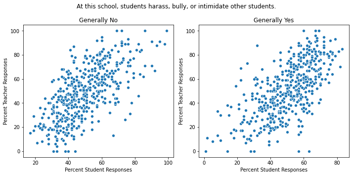
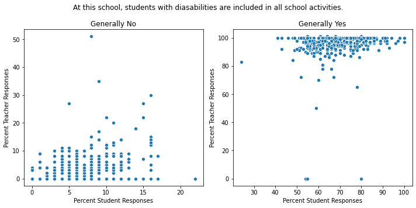
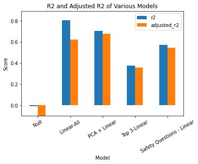
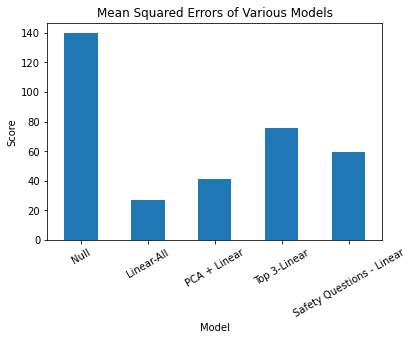
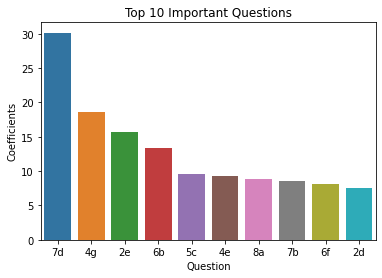

## NYC Schools

## Exectutive Statement

---
Table of Content:
1. [Problem Statement](#problem)
2. [Description of Data](#data)
    * [Surveys](#survey)
    * [Test Scores](#test)
3. [Analysis](#analysis)
    * [Students and Teachers Perceptions](#svst)
    * [Models](#models)
    * [Important Students' Percetions](#student)
4. [School Map](#map)
5. [Conclusion](#conclusion)

### 1. Problem Statement  
There is a large discrepancy in students performance among schools in the nation, and New York city schools are not an exception. There is a lack of analysis that can lead to actionable results. Here, I analyze the NYC School Surveys, which have been given students, parents, and teacher every year since 2006, in order to seek insights to student performance discrepancy issues. Specifically, I am seeking whether the survey questions, and their responses are indicators that are tied to student performance. If these questionaries can predict, then what are the questions that are driving those predictions?   
The surveys can give us some understanding of the school enviroment. Therefore, they can potentially represent engagement of students, parents, and teachers in their respective schools.   

---

### 2. Description of Data
I am using data available through [Open Data NYC](https://opendata.cityofnewyork.us) and [NYC Department of Education](https://infohub.nyced.org/reports/school-quality/nyc-school-survey) from years 2015-2019. Here, I will be summarizing the results obtained from 2018-2019 academic year only. However, data were collected from 2015-2019, and some of the scripts are written to accomodate files from different years.  

**NYC Schools Surveys**:  
From the original excel files, I extracted data containing the responses in percent resondents from each school. Each of those surveys are separated by student, parent, and teacher surveys. The surveys from 2019 can be seen here for [student](./assets/student-survey_2019.pdf), [teacher](./assets/teacher-survey_2019.xlsx), and [parent](./assets/parent-survey_2019.pdf). The surveys included the following number of questions: students = 64, parents = 43, and teachers = 49. In every iteration of the dataframes generated, I kept the corresponding question number from the original survey. For answer options, they were assigned a number that corresponded to the order in which it appears in the survey (with the exception of `N/A` choice, which was always assigned a number `0`). In dataframes with all 3 surveys incorporated, a `_s`, `_p`, `_t` was assigned for student, parent, and teacher, repectively. For example, a `1c` and second choice (`disagree` in this case) from the parent survey would be represented as `1c_2_t`.  
Missing data in surveys were assumed to be absent, and therefore, all missing data were filled with 0. These will become the input data for the combining process.  

**Test Scores**:  
I downloaded the state tests from [NYC DOE](https://infohub.nyced.org/reports/school-quality/nyc-school-survey). Both English Language Arts (ELA) and Math scores from state assessments were obtained. The dataset includes scores from years 2014-2019. These scores are for state assessment test for grades 3-8, so schools with grades 9-12 will not be included in this analysis. Schools with no scores were removed from the analysis.  

After combining all surveys data and scores, the dataset included over 1000 features. This number makes it essentially impossible to understand the contribution from indivdual question/response to a predictive model. Therefore, I chose to focus on survey data from students only during this analysis. The student survey dataset alone still has a large number of features, so further steps were taken to reduce the number of features. Because each feature is a question-answer choice pair, and because most answer choices were nominal in nature, I combined them in a way that one question becomes one feature (instead of multiple per question). This transformation was done by converting answer choices to nonimal numbers (e.g. 1 = Strongly Disagree, 2 = Disagree, 3 = Agree, 4 = Strongly Agree) and multiplying the nominal number to corresponding fraction of responses. After these conversion, I summed all possible choices together. These engineered combined-features are representing each questions with the information of the responses. (The corresponding process is [this jupyter notebook](./code/5_summarize_data.ipynb).)  
For scores, I used a composite score of Math and ELA scores as a target for the regression models. The composite score
The resulting [dataset](./data/summary_student.csv) is what is used in modeling and the bulk of the analysis. For all analyses, schools without test scores were dropped, so only 482 schools were analyzed.

---

### 3. Analysis

**Students and Teachers Percetions**:
When looking and comparing responses from students and teachers, there is a general trend that teachers are seeing (and agreeing with) what the students see in their school environment. Here are are the responses of two separate questions from students and teachers from 2019 surveys.   
  
  
In most schools, students and teachers agree on their opinon on their school environment. However, there is generally more variance with students responses whereas teachers as unit may be more in agreeance with each other.  

**Models**:
Interpreting the contribution from each survey question is important for this project, so model choices were driven by this goal. With first iteration of the model using all survey responses (before summarizing to contain one question as one feature), I included a [pricipal component analysis followed by a linear regression model](./code/7_pca_linear_reg.ipynb) to see if the surveys can predict the students scores. Using 20 pricipal components, the linear regression model had an adjusted R2 score of 0.72. Using just the students responses (after summarizing) has an adjusted R2 score 0.75 (In the figure below, the results from using 10 principal components are shown in the `PCA + Linear` model.)
Here, linear regression models as well as gradient booster regression were used for predicticting students scores.

Can Survey Questions Predict Students' Performance on State Assessment Tests? Student Survey Results Can Predict Students Scores:

 R2 and Adjusted R2 Scores            | Mean Squared Erros
:-------------------------:|:-------------------------:
  |  

When student survey data were used without any dimentional or feature reduction, the adjusted R2 value is 0.62. There is quite a bit of collinearity among questions, and it was impossible to remove all the collinearity by feature selection. There were only a few questions that I removed for analyses because there were questions that were addressing the same issues. However, reducing the dimentionality by using 10 principal componets after PCA, it did improve the performance of the model slightly (to adjsted R2 = 0.68; see figure above). Using a ridge model to regularize the features and selecting 3 features with the top 3 coefficients decrease the model performance, but these questions alone can explain about 37 % of the data. These questions are:  
7d. I feel safe in my classes at this school.  
4g. My classes at this school really make think critically.  
2e. I know what my teacher wants me to learn in class.  
When looking at these questions invidually, question 7d alone had an R2 of 0.24, so it seems like this question alone has a significant contribution to the regression model.  
Combined, these results indicate that the surveys do provide indicators of students' performance at those schools. The scorings are relatively high even a few subsamples of the questions/responses predict students' performance.

**Important Students' Perceptions**:  
When looking at individual features and their contribution, a few questions start to jump out. Because of the collinearity of features, it is hard to decipher which questions are the top contributors. However, because various other models (select k best + linear and [gradient boosting regressions](./code/9_gradient_boosting.ipynb); not described in details here) also consistently places some of the questions relating to how safe students feel in and around the school, I also use a linear regression model using just those questions (these are questions 7s and 8s in the [student survey](./assets/student-survey_2019.pdf)). The coefficients demonstrated below in the figure are from the a linear regression model (using just the student [summary survey data](./data/summary_student.csv)) without feature engineering, so the order of importance may not be as accurate. However, questions relating to the perception of safety (question numbers starting 7 or 8) by students were often in the the top 10.

Students questions that are important in predicting state assessement performance.  

---

### 4. School Map  
This folium map is attempting to provide a visual tool to get the information about students scores and a score of how 'safe' the students feel at each school. At this moment, the map can be deployed locally only, but future instances will be available for access on a website. For the moment, the prototype is available to download locally [here](./assets/schools_map.html).

---

### 5. Conclusions
Students opinions are important in predicting students' test performance. Particually, how safe students feel in and around school has strong impact on the students performance. The crime rate in the neighborhood in which the school resides is probably correlated to how safe the students feel. This factor is hard to control by the schools. However, there are other 'safety' factors that schools can address and improve students' learning environments. Because teachers are generally noticing bullying and harassment in their students, the teachers, in theory, have the opportunity to intervene. Those interventations should be a priority whenever appropriate. Predicting students is not one dimentional, but removing some elements that are preventing students from learning would be beneficial.
